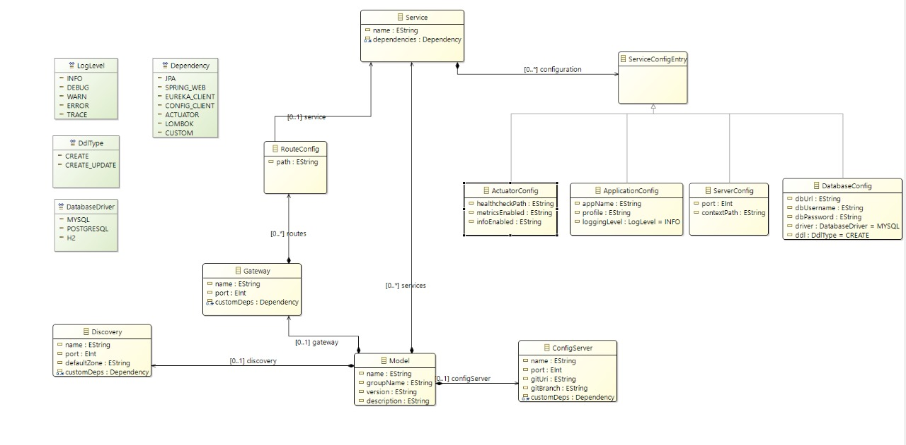
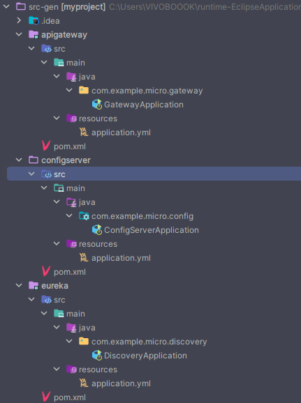
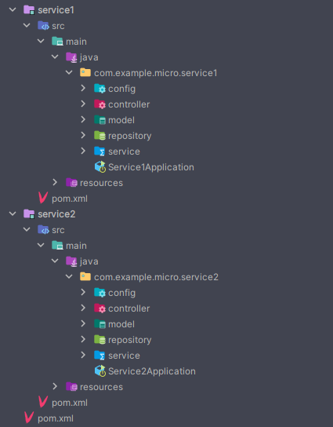

# Spring Boot Microservice Project Starter Generator DSL

## Introduction

A Domain-Specific Language (DSL) designed to streamline and automate the creation of Spring Boot microservice architectures. This tool empowers developers to rapidly prototype and deploy microservice-based applications by providing a declarative approach to defining service configurations, dependencies, and interactions.

## Problem Statement

Setting up a microservice architecture with Spring Boot involves numerous repetitive tasks:

- Creating consistent project structures across multiple services
- Configuring service discovery, API gateway, and config servers
- Managing inter-service dependencies and communication
- Ensuring consistent configuration across all services
- Implementing proper service discovery and registration

This DSL addresses these challenges by providing a simple, declarative way to define entire microservice architectures, reducing setup time and potential configuration errors.

## Grammar Definition



### Project Structure

The root element containing all microservice components:

- `project`: Defines the project name (required)
- `group`: Specifies the project group ID (required)
- `version`: Sets the project version (required)
- `description`: Provides project description (optional)

### Discovery Service

Eureka server configuration for service discovery:

- `discovery`: Service name for the Eureka server
- `port`: Server port number
- `defaultZone`: Eureka server URL for client registration
- `dependencies`: Additional dependencies beyond default ones

### Config Server

Centralized configuration management:

- `config-server`: Server name
- `port`: Server port number
- `git-uri`: Git repository URL containing configuration files
- `git-branch`: Target Git branch for configurations
- `dependencies`: Required dependencies for the config server

### Microservices

Individual service definitions with comprehensive configuration options:

- `service`: Unique service identifier
- `dependencies`: Service-specific dependencies including:
  - Predefined dependency sets (JPA, LOMBOK, etc.)
  - Custom dependencies
- `config`: Service configuration sections:
  - `server-config`: Server-specific settings
    - `port`: Service port number
    - `context-path`: Base URL path
  - `application-config`: Application settings
    - `name`: Application name
    - `profile`: Active profile
    - `logging`: Logging configuration
  - `database-config`: Database connectivity
    - `url`: JDBC connection URL
    - `username`: Database username
    - `password`: Database password
    - `driver`: Database driver type
    - `ddl`: Schema generation strategy
  - `actuator-config`: Monitoring endpoint configuration

### API Gateway

Central entry point for the microservice ecosystem:

- `gateway`: Gateway service name
- `port`: Gateway port number
- `routes`: Service routing configuration
  - `path`: URL path pattern
  - `service`: Target service name
- `dependencies`: Gateway-specific dependencies

## Example Usage

```
project myproject
group com.example.micro
version "1.0.0"
description "My microservices project"
{
    discovery eureka {
        port 8762
        defaultZone "http://localhost:8761/eureka/"
        dependencies { }
    }
    service service1 {
        dependencies {
            CONFIG_CLIENT
            JPA
            LOMBOK
        }
        config {
            application-config {
                name "dddd"
            }
            server-config {
                port 8081
                context-path "/service1"
            }
            database-config {
                url "jdbc:mysql://localhost:3306/dbn"
                username "user"
                password "pass"
                driver MYSQL
                ddl CREATE_UPDATE
            }
        }
    }

    gateway apigateway {
        port 8080
        routes {
            route {
                path "/api/service1/**"
                service service1
            }
        }
        dependencies { }
    }
}
```

## Validation Rules

### Port Validation

- Valid port range: 1024-65535
- Port uniqueness across all components
- Required port configuration for all networked services

### Service Validation

- Unique service names across the project
- Mandatory server configuration
- Recommended application configuration
- Complete database configuration when present:
  - Valid JDBC URL format validation
  - Required credentials
  - Supported database driver specification

### Dependency Validation

- Automatic inclusion of core dependencies:
  - SPRING_WEB
  - EUREKA_CLIENT
- JPA dependency requirement for database configurations
- Recommended CONFIG_CLIENT for all services

### Route Validation

- Unique route paths in gateway configuration
- Existence validation for referenced services
- Valid URL pattern formatting

## Generated Output

### Directory Structure

The DSL generates a complete project structure including:




- Separate modules for each service
- Configuration files
- Service implementations
- Common utility modules

### Generated Artifacts

- Service-specific application.yml files
- Docker configuration files
- Service discovery configuration
- API gateway routing setup
- Database configuration files

## Limitations

Current version limitations:

- Focuses on project structure and configuration only
- Limited to Spring Boot ecosystem
- No support for custom security configurations

## Future Enhancements

Planned features for future releases:

- Custom security configuration support
- Basic service implementation templates
- Custom dependency management
